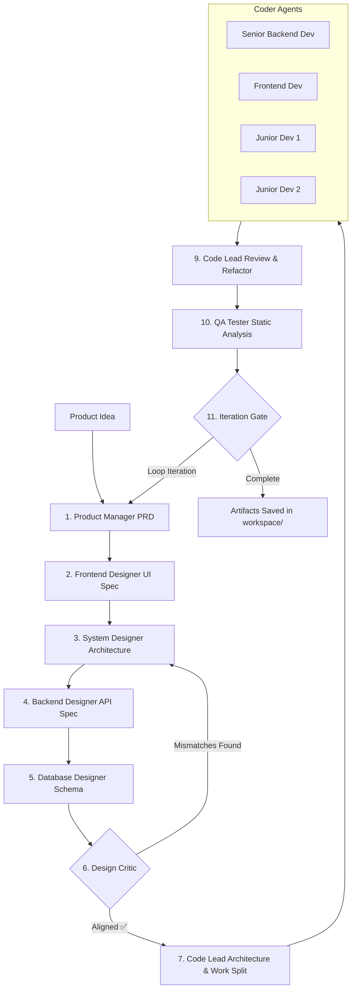

# AI Tech Team 🚀

> **Autonomous Multi-Agent AI Software Engineering Team powered by LangGraph, Python, & OpenRouter.**

An end-to-end multi-agent orchestration framework that transforms raw product ideas into complete, production-ready software specifications and TypeScript / Next.js codebases.

---

## 🌟 Overview

**AI Tech Team** simulates a full-stack software development company. Using modular specialized agents with distinct system prompts and context windows, the framework drives a complete product development cycle—from product definition and architecture design to multi-developer coding, automated code review, and QA verification.

Key highlights:
- **Model Agnostic & OpenRouter Ready**: Works with top-tier models (GPT-4o, Claude 3.5 Sonnet) as well as cost-effective or free OpenRouter models (`liquid/lfm-2.5-2.6b:free`, `gpt-4o-mini`).
- **LangGraph Checkpointing**: State persistence with `AsyncSqliteSaver`, allowing workflows to pause, resume, or run across multiple iteration loops.
- **Structured Hand-Offs**: Strict delimiter-based output protocols (`### FILE: path`) to parse and persist multi-file software projects automatically.
- **Self-Healing Design Critic**: Automatic verification loop between architecture, API, and database specifications before code generation begins.

---

## 🏗️ Architecture & Agent Workflow

The orchestration pipeline follows a sequential-parallel multi-agent workflow:



### 👥 Agent Roles

| Agent Role | Responsibilities | Output Artifact |
| :--- | :--- | :--- |
| **Product Manager** | Analyzes feature requirements, classifies complexity (`TINY`/`SMALL`/`MEDIUM`/`LARGE`), writes PRD. | `prd.md` |
| **Frontend Designer** | Designs MVP UX/UI wireframes and screen flows. | `ui-spec.md` |
| **System Designer** | Outlines high-level module architecture, tech stack, and scalability choices. | `system-design.md` |
| **Backend Designer** | Defines REST API routes, schemas, request/response models, and status codes. | `backend-design.md` |
| **Database Designer** | Defines relational database models, indexes, constraints, and migrations. | `database-design.md` |
| **Design Critic** | Performs cross-specification validation to eliminate design mismatches. | `design-review.md` |
| **Code Lead** | Generates project configuration files (`package.json`, `tsconfig.json`, `schema.prisma`) and divides work among coders. | `work-split.md` |
| **Coder Sub-Team** | Writes complete, strict TypeScript/Next.js files in parallel or sequential mode. | Source files under `code/` |
| **Code Lead Reviewer** | Performs code review, checks compilation readiness, and auto-applies code fixes. | `code-review.md` |
| **QA Tester** | Conducts static inspection against P0 acceptance criteria and edge cases. | `qa-report.md` |

---

## 📁 Repository Structure

```
tech_team/
├── orchestrator/          # Core Python LangGraph Pipeline
│   ├── main.py            # CLI Entrypoint (run / resume commands)
│   ├── graph.py           # LangGraph StateGraph & Node Definitions
│   ├── agents.py          # Prompt loader & Coder file extractor
│   ├── agents_lg.py       # OpenRouter Async Completion Wrapper
│   ├── llm.py             # OpenRouter Client & Model Resolver
│   └── requirements.txt   # Python Dependencies
├── prompts/               # Role-Specific System Prompts
│   ├── product_manager.md
│   ├── system_desginer.md
│   ├── backend_desginer.md
│   ├── database_desginer.md
│   ├── frontend_desginer.md
│   ├── design_critic.md
│   └── coders/            # Coder & QA Prompt Specifications
├── docs/                  # System Architecture & Protocol Documentation
│   └── design/            # Detailed Department & Workflow Guidelines
├── workspace/             # Generated Projects Output Directory
├── .env.example           # Environment Variables Template
└── .gitignore             # Security & Build Artifact Exclusions
```

---

## ⚡ Quick Start

### 1. Prerequisites

- Python 3.10+
- An [OpenRouter API Key](https://openrouter.ai/)

### 2. Installation

Clone the repository and set up a virtual environment:

```bash
git clone https://github.com/YOUR_USERNAME/tech_team.git
cd tech_team

# Create virtual environment
python -m venv venv

# Activate virtual environment
# Windows (PowerShell):
.\venv\Scripts\Activate.ps1
# Linux/macOS:
source venv/bin/activate

# Install dependencies
pip install -r orchestrator/requirements.txt
```

### 3. Environment Configuration

Copy `.env.example` to `.env` and add your OpenRouter API Key:

```bash
cp .env.example .env
```

Edit `.env`:

```env
OPENROUTER_API_KEY=sk-or-v1-your-actual-api-key-here

# Optional: Override models per role or globally
OPENROUTER_MODEL=openai/gpt-4o-mini
```

---

## 🛠️ Usage

### Run a New Product Idea

Execute the orchestrator with your product prompt:

```bash
python orchestrator/main.py run "A URL shortener platform with custom slugs, analytics dashboard, and expiration links" --project link_shortener
```

#### CLI Options:
- `--project <NAME>`: Custom output folder name inside `workspace/` (default: auto-generated `proj_XXXX`).
- `--iter <N>`: Set number of iteration cycles (default: 1).
- `--auto`: Automatically proceed through feedback iterations without prompting.

### Resume an Existing Project

Resume execution from a checkpointed state:

```bash
python orchestrator/main.py resume --project link_shortener
```

### Output Location

Generated code and documentation artifacts are persisted under:
```
workspace/<project_name>/
├── code/                  # Runnable source code files
│   ├── package.json
│   ├── tsconfig.json
│   ├── prisma/schema.prisma
│   └── src/
└── specs/                 # Product & Architecture Specifications
    ├── prd.md
    ├── ui-spec.md
    ├── system-design.md
    ├── backend-design.md
    ├── database-design.md
    ├── design-review.md
    ├── work-split.md
    ├── code-review.md
    └── qa-report.md
```

---

## 🛡️ Security & Privacy

- Secret keys are **never** committed to version control.
- `.env` and SQLite checkpoint databases (`*.sqlite`) are ignored by `.gitignore`.
- Always inspect generated `.env.example` templates in sub-projects before deployment.

---

## 📄 License

MIT License. Free to use, modify, and distribute for personal and commercial projects.
